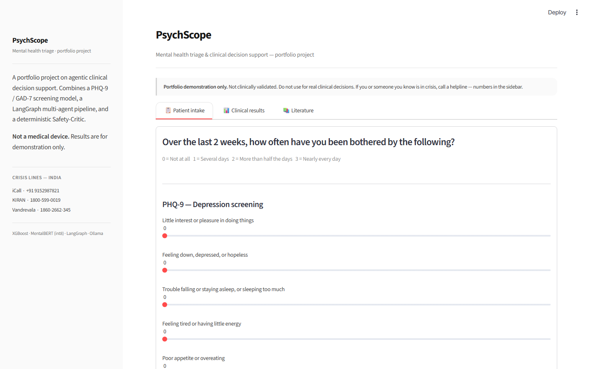

<div align="center">

# Psychiatrist

A mental-health triage and clinical decision-support system built around a multi-agent pipeline.<br>
Fill in a PHQ-9 / GAD-7 screening and a short clinical note — get back a severity assessment, a safety verdict, and a care plan.



[](https://github.com/omprxkash/data-scientist/actions/workflows/ci.yml)


</div>

---

## ⚡ Quickstart — three commands, no GPU required

```bash
pip install -e ".[dev]"
python data/generate.py --n 50000 --out data/processed
streamlit run serving/app.py --server.port 8501
```

Open `http://localhost:8501`. Works in heuristic-fallback mode without Ollama, trained models, or a Java runtime. See [Running it](#running-it) for the full pipeline.

---

## What it does

Submit the screening form and a brief note. The five-agent pipeline runs in sequence:

```
🔍 Screening  →  ⚠️ Risk Assessment  →  📚 DSM + PubMed  →  💊 Care Plan  →  🛡️ Safety Critic
```

| 🎯 Severity assessment | 🛡️ Safety verdict | 💊 Care plan |
|:---:|:---:|:---:|
| PHQ-9 band (none → severe) | `routine` / `monitor` / `escalate` | Agent-generated next steps |
| Colour-coded card + SHAP | Deterministic rules + LLM verifier | Grounded in retrieved literature |
| GAD-7 anxiety overlay | 100% recall gate on SI test set | Falls back to rule-based if LLM off |

- **Severity classifier** — XGBoost trained on PHQ-9 + GAD-7 tabular features predicts the depression severity band.
- **MentalBERT** (int8-quantised) reads the narrative for clinical signals and flags suicidal ideation.
- **Hybrid RAG** (FAISS + BM25) retrieves DSM-5 criteria and PubMed abstracts for the detected signals.
- **Care-plan agent** synthesises severity, signals, and literature into actionable suggestions.
- **Safety-Critic** runs last and cannot be overridden — deterministic regex rules fire first, the LLM verifier adds nuance. A 16-case suicide-risk regression suite gates every commit at **100% recall**.

---

## 🏗️ How it works


<details>
<summary>ASCII fallback (terminal / no image rendering)</summary>

```
                    ┌─────────────────────────────────────────────┐
                    │              Streamlit UI                    │
                    │   structured intake + narrative input        │
                    └────────────────────┬────────────────────────┘
                                         │
                    ┌────────────────────▼────────────────────────┐
                    │           LangGraph orchestrator             │
                    │                                              │
                    │  Screening → Risk → DSM/Lit → Care Plan      │
                    │                                  │           │
                    │                                  ▼           │
                    │                         ┌────────────────┐   │
                    │                         │ Safety-Critic  │   │
                    │                         │  (det + LLM)   │   │
                    │                         └────────────────┘   │
                    └──┬──────────┬──────────┬──────────┬──────────┘
                       │          │          │          │
                  ┌────▼───┐ ┌────▼───┐ ┌────▼───┐ ┌────▼───┐
                  │XGBoost │ │Mental- │ │ FAISS  │ │Ollama  │
                  │severity│ │ BERT   │ │ DSM +  │ │Llama3.2│
                  │        │ │        │ │ PubMed │ │  3B    │
                  └────────┘ └────────┘ └────────┘ └────────┘
```

</details>

The orchestration is a straight LangGraph DAG — every node is isolated, independently testable, and fails gracefully if its dependency (Ollama, MentalBERT, trained model) is unavailable. The Safety-Critic always runs last. Its verdict is what the UI surfaces; everything else is supporting evidence.

For a deeper technical walkthrough — per-agent responsibilities, the two-layer Safety-Critic design, fallback patterns — see [ARCHITECTURE.md](ARCHITECTURE.md).

---

## 🧰 Tech stack

| Layer | Choice | Why |
|---|---|---|
| Agent orchestration | LangGraph | Deterministic DAG — testable node-by-node |
| LLM | Llama-3.2-3B via Ollama | Fully local; zero paid API calls in any code path |
| NLP / SI detection | MentalBERT int8 | Domain-pretrained on mental health text; runs on CPU |
| Severity model | XGBoost + PyTorch MLP | XGBoost wins on tabular PHQ-9/GAD-7; MLP included as a neural baseline |
| RAG | FAISS + BM25 hybrid | Dense retrieval for semantic match + BM25 for clinical keyword precision |
| UI | Streamlit | Custom CSS design tokens — less generic than stock Streamlit |
| API | FastAPI | Pydantic validates PHQ-9/GAD-7 item ranges (0–3); per-IP rate limiting |
| MLOps | MLflow + Evidently | Experiment registry + drift detection; wired for auto-retrain on drift |
| Data | Synthetic generator + PySpark ETL | No real PHI; calibrated to published prevalence tables |

---

## Why I built it

I wanted to learn agentic AI properly — not just by reading about LangGraph but by building something where the agents actually have to coordinate around a real constraint. Psychiatry turned out to be a good fit: it is heavily text-based (so it runs on a laptop without a GPU), the clinical structure is well-defined (PHQ-9, GAD-7, DSM-5), and there is a clear safety constraint that forces you to think about agent failure modes instead of just chaining LLM calls.

The other reason: I wanted one project that exercises the whole stack — classical ML, NLP, RAG, agent orchestration, MLOps — coherently, instead of five disconnected demos.

---

## 📂 What's inside

| Path | Purpose |
|---|---|
| [ARCHITECTURE.md](ARCHITECTURE.md) | Deep-dive: per-agent design, two-layer Safety-Critic, fallback patterns |
| [agents/](agents/) | LangGraph DAG + 5 agent nodes including `safety_critic.py` |
| [models/](models/) | Severity classifier (XGBoost + MLP) and clinical NLP (MentalBERT fine-tune) |
| [rag/](rag/) | Hybrid FAISS + BM25 retriever over DSM-5 summaries and PubMed |
| [serving/](serving/) | Streamlit UI (`app.py`) + FastAPI service (`api.py`) |
| [spark_jobs/](spark_jobs/) | PySpark ETL for synthetic data generation and Reddit cohort |
| [monitoring/](monitoring/) | Evidently drift reports + immutable per-request safety audit log |
| [tests/safety/](tests/safety/) | 16-case SI regression suite — 100% recall is the release gate |
| [data/](data/) | Synthetic PHQ-9/GAD-7 generator + DVC-tracked data sources |
| [psychiatrist/](psychiatrist/) | CLI entry point (`psychiatrist serve / api / safety / data`) |

---

## 🧪 Tests

```bash
pytest tests/safety/ -v -m safety   # 16-case safety regression — must be 16/16
pytest tests/ -v --cov=agents       # full suite
ruff check . && mypy agents models  # lint
```

CI runs on every push — see [.github/workflows/ci.yml](.github/workflows/ci.yml).

---

<details>
<summary>🚀 Running the full pipeline (Ollama + trained models)</summary>

```bash
ollama pull llama3.2
python -m models.train --task severity --model xgboost
python -m models.train --task clinical_nlp --model mentalbert
python -m rag.ingest_dsm_summaries --out rag/indexes/dsm
```

`make train` runs on CPU. MentalBERT fine-tune takes a few hours for a full pass — use `--max-train-samples 5000` for a quick dev run.

**Or use the CLI** (installed with `pip install -e "."`):

```bash
psychiatrist serve       # Streamlit on :8501
psychiatrist api         # FastAPI on :8000
psychiatrist safety      # safety regression suite
psychiatrist data        # generate synthetic records
```

</details>

<details>
<summary>📊 Skill matrix — where to find evidence for DS role requirements</summary>

| Skill area | Where to look |
|---|---|
| ML model training & evaluation | [models/severity/](models/severity/) — XGBoost, LightGBM, Torch MLP; [MODEL_CARD.md](models/severity/MODEL_CARD.md) for fairness slices |
| Transformer fine-tuning | [models/clinical_nlp/](models/clinical_nlp/) — MentalBERT fine-tune + int8 quantization |
| Retrieval-augmented generation | [rag/](rag/) — hybrid FAISS + BM25 retriever; DSM-5 and PubMed ingestion |
| LLM agent orchestration | [agents/](agents/) — 5-node LangGraph DAG with graceful dependency fallback |
| Safety-critical system design | [agents/safety_critic.py](agents/safety_critic.py) + [tests/safety/](tests/safety/) |
| MLOps / experiment tracking | [models/train.py](models/train.py) + [monitoring/](monitoring/) — MLflow registry, Evidently drift |
| Data engineering / PySpark | [spark_jobs/](spark_jobs/) — synthetic data generator + Reddit mental-health ETL |
| REST API design | [serving/api.py](serving/api.py) — FastAPI with Pydantic validation + rate limiting |
| UI / product sense | [serving/app.py](serving/app.py) — Streamlit with custom design tokens |

</details>

<details>
<summary>⚠️ Honest limitations</summary>

- **All training data is synthetic.** PHQ-9 / GAD-7 distributions calibrated to published prevalence tables (Kroenke 2001; Manea 2012), but there is no real patient data in this repo.
- **Not clinically validated.** Every piece of output should be read as "what a model trained on synthetic data thinks", not as a clinical recommendation.
- **Fallback heuristics matter.** When Ollama / MentalBERT / the trained XGBoost are unavailable, the system falls back to keyword matching and rule-based scoring. The Safety-Critic deterministic rules always fire.
- **No PII anywhere.** The audit log stores feature vectors and predictions only.

</details>

<details>
<summary>🚧 What's still in flight</summary>

| Component | Status | Notes |
|---|---|---|
| Model training | Not run | `make train` to produce XGBoost + MentalBERT checkpoints |
| RAG indexes | Not built | `make rag-index` for FAISS + BM25 over DSM + PubMed |
| Docker | Scaffolded | `docker/` dir exists; Dockerfile + compose TBD |
| Deployment | Not started | Options: Hugging Face Spaces, Render, AWS ECS |
| MLflow server | Referenced only | Dependency installed; no remote server configured |

</details>

---

## License

MIT — see [LICENSE](LICENSE).
