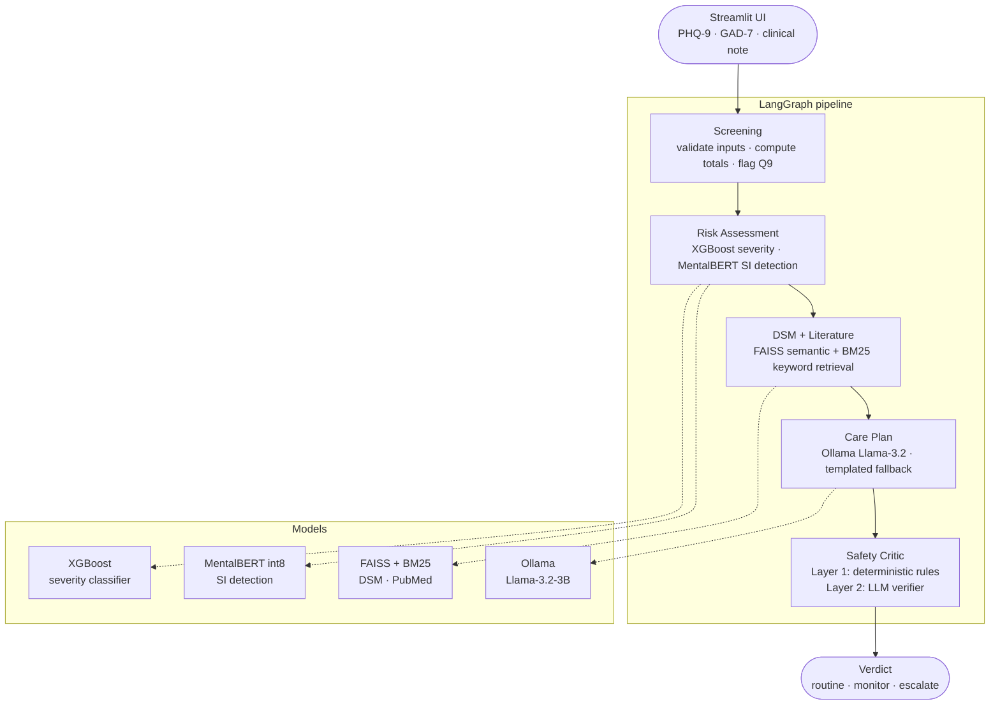

<div align="center">

# Psychiatrist

A mental-health triage assistant that takes a PHQ-9 / GAD-7 screening form and a short clinical note, then returns a severity label, a safety verdict, and a suggested care plan — all running locally on a laptop.


[](https://github.com/omprxkash/data-scientist-mlops/actions/workflows/ci.yml)


</div>

---

## Why I built this

I wanted to actually work with agentic AI, not just read about it — something where agents have to coordinate around a real constraint, not just chain together LLM calls.

Mental health triage turned out to be a good fit. The clinical structure is well-defined (PHQ-9, GAD-7, DSM-5), the domain is text-heavy so everything runs on a CPU laptop, and there's a concrete safety constraint: a patient flagged for suicidal ideation must be escalated, no exceptions. That constraint forced me to think about failure modes properly.

What happens when the language model is offline? What happens when the model hasn't been trained yet? Can a hallucinating care-plan agent override the safety layer? The answer to that last one is no — deterministic keyword rules fire before the LLM ever sees the output, and nothing downstream can reverse them.

I also wanted one project that covers the full stack: classical ML, clinical NLP, retrieval-augmented generation, agent orchestration, and MLOps — in a way that actually fits together, rather than five separate toy demos.

---

## Try it in three commands

No GPU, no Ollama, no trained models required for the quickstart. Everything falls back gracefully.

```bash
pip install -e ".[dev]"
python data/generate.py --n 50000 --out data/processed
streamlit run serving/app.py --server.port 8501
```

Open `http://localhost:8501`. See [Running the full pipeline](#running-the-full-pipeline) if you want Ollama + trained models.

---

## How the pipeline works

Every request goes through five agents in sequence. There are no branches — each agent runs regardless of what the previous one found, and they share a single state object that gets filled in as it moves through the graph.



### What each agent does

**Screening** — validates that PHQ-9 and GAD-7 item scores are in range (0–3), computes totals, and flags whether PHQ-9 item 9 (suicidal ideation) is non-zero. That flag feeds directly into the Safety Critic's deterministic layer.

**Risk Assessment** — runs the XGBoost severity classifier on the questionnaire scores to get a severity band (none / mild / moderate / severe). Then runs MentalBERT — a BERT model pre-trained on mental health text, quantized for CPU — over the clinical narrative to produce a suicidal ideation probability. Falls back to regex keyword matching if MentalBERT isn't loaded.

**DSM + Literature** — searches two local indexes: paraphrased DSM-5 criteria summaries and PubMed psychiatry abstracts. Uses FAISS for dense semantic search and BM25 for keyword matching, then merges and re-ranks the results with a cross-encoder. The retrieved passages are what ground the care plan suggestions in clinical literature.

**Care Plan** — uses Llama 3.2 via Ollama to generate suggestions from the severity band, detected symptoms, and retrieved passages. If Ollama isn't running, it falls back to templated recommendations based on the severity band. Either way something useful comes out.

**Safety Critic** — always runs last, always runs both layers:

- *Layer 1 (deterministic):* checks for suicidal ideation keywords sentence-by-sentence, excluding reported speech patterns like "the patient said they were not suicidal". If this fires, the verdict is `escalate` and the LLM layer is skipped.
- *Layer 2 (LLM):* if Layer 1 didn't fire, the LLM checks the care plan for hallucinated symptoms, unsupported claims, and overconfident phrasing. The LLM can upgrade a `routine` to `monitor`, but it cannot downgrade an `escalate`. For moderate or above PHQ-9 bands, the minimum verdict is `monitor` regardless.

A 16-case regression suite covers both obvious and subtle suicidal ideation patterns. It must pass at 100% recall on every push.

---

## Tech stack

| Layer | Choice | Why |
|---|---|---|
| Agent orchestration | LangGraph | Explicit graph — each node is a class you can test in isolation |
| LLM | Llama-3.2-3B via Ollama | Fully local, no API keys, works offline |
| NLP / SI detection | MentalBERT int8 | Domain-pre-trained on mental health text, runs on CPU in reasonable time |
| Severity model | XGBoost + PyTorch MLP | XGBoost wins on tabular PHQ-9/GAD-7 scores; MLP is the neural baseline |
| Retrieval | FAISS + BM25 hybrid | Dense semantic search + keyword matching, cross-encoder re-rank on the merged set |
| UI | Streamlit | Custom CSS design tokens — less generic than default Streamlit |
| API | FastAPI | Pydantic validates item ranges (0–3); per-IP rate limiting |
| MLOps | MLflow + Evidently | Experiment tracking + drift detection; structured for auto-retrain on drift signal |
| Data | Synthetic pandas generator + PySpark ETL | No real patient data; PHQ-9/GAD-7 distributions calibrated to published prevalence tables |

---

## What's in the repo

| Path | What it is |
|---|---|
| [ARCHITECTURE.md](ARCHITECTURE.md) | Full technical walkthrough — per-agent design, Safety Critic internals, retriever details |
| [agents/](agents/) | LangGraph DAG definition and all five agent classes |
| [models/](models/) | XGBoost + MLP severity training, MentalBERT fine-tuning and quantization |
| [rag/](rag/) | Hybrid FAISS + BM25 retriever, DSM and PubMed ingestion scripts |
| [serving/](serving/) | Streamlit UI (`app.py`) and FastAPI service (`api.py`) |
| [spark_jobs/](spark_jobs/) | PySpark ETL for synthetic data and Reddit cohort |
| [monitoring/](monitoring/) | Evidently drift reports and per-request safety audit log |
| [tests/safety/](tests/safety/) | 16-case suicidal ideation suite — 100% recall is the release gate |
| [data/](data/) | Synthetic PHQ-9/GAD-7 generator |

---

## Running tests

```bash
pytest tests/safety/ -v -m safety   # safety regression — must be 16/16
pytest tests/ -v --cov=agents       # full suite
ruff check . && mypy agents models  # lint + types
```

The safety suite runs in CI on every push without Ollama or trained models — agents fall back to rules automatically.

---

<details>
<summary>Running the full pipeline (Ollama + trained models)</summary>

```bash
ollama pull llama3.2

# Train severity models
python -m models.train --task severity --model xgboost
python -m models.train --task clinical_nlp --model mentalbert

# Build RAG indexes
python -m rag.ingest_dsm_summaries --out rag/indexes/dsm
```

`make train` wraps these up. MentalBERT fine-tuning takes a few hours on CPU — use `--max-train-samples 5000` for a quick dev run.

CLI shortcuts (after `pip install -e "."`):

```bash
psychiatrist serve    # Streamlit on :8501
psychiatrist api      # FastAPI on :8000
psychiatrist safety   # run the safety regression suite
psychiatrist data     # generate synthetic records
```

</details>

<details>
<summary>Limitations worth knowing</summary>

**Synthetic data only.** PHQ-9 / GAD-7 distributions are calibrated against published prevalence tables (Kroenke et al. 2001; Manea et al. 2012), but there is no real patient data in this repo.

**Not clinically validated.** Everything this system outputs should be read as "what a model trained on synthetic data produces" — not as a clinical recommendation.

**Fallbacks are real.** When Ollama, MentalBERT, or the XGBoost checkpoint are unavailable, the system falls back to keywords and rule-based scoring. The Safety Critic's deterministic rules always fire regardless of what else is available.

**No PII anywhere.** The audit log stores feature vectors and model outputs only.

</details>

<details>
<summary>Roadmap</summary>

| Component | Status |
|---|---|
| Model training | Run `make train` — XGBoost + MentalBERT checkpoints not included in repo |
| RAG indexes | Run `make rag-index` — FAISS + BM25 indexes built locally |
| Docker | Scaffolded — Dockerfile + compose in progress |
| Deployment | Evaluating Hugging Face Spaces and Render |

</details>

---

## License

MIT — see [LICENSE](LICENSE).
